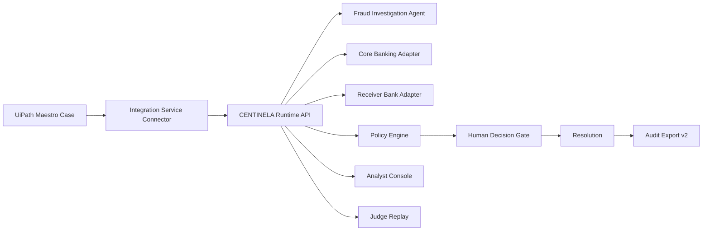
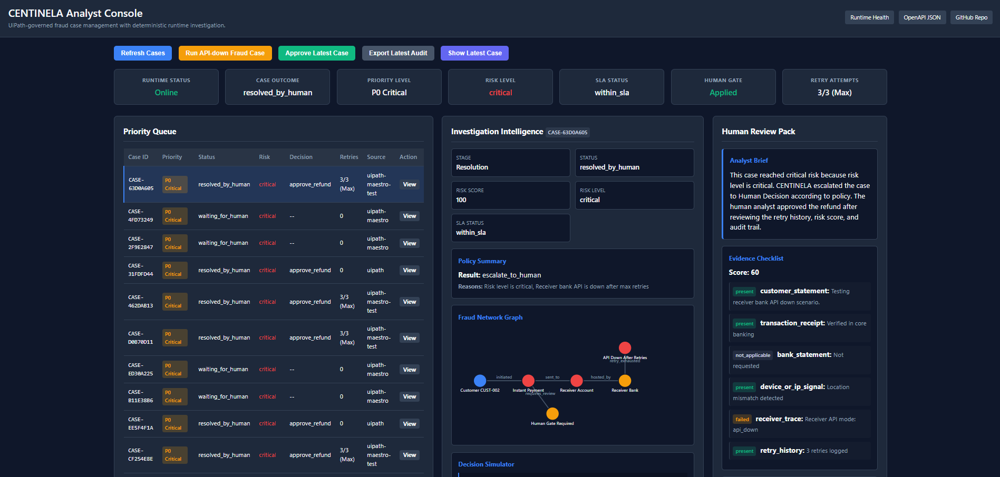

# CENTINELA — UiPath-Governed Fraud Dispute Intelligence

Agentic case management for instant-payment fraud disputes: Maestro orchestrates the case, CENTINELA Runtime investigates, humans decide, and every step is auditable.


### Core Links
*   **[Judge Replay](https://centinela-uipath-agenthack.onrender.com/judge)**
*   **[Analyst Console](https://centinela-uipath-agenthack.onrender.com/analyst)**
*   **[Runtime Health](https://centinela-uipath-agenthack.onrender.com/health)**
*   **[OpenAPI](https://centinela-uipath-agenthack.onrender.com/openapi.json)**
*   **[UiPath Evidence Pack](docs/UIPATH_EVIDENCE_PACK.md)**
*   **[Product Feedback](docs/UIPATH_PRODUCT_FEEDBACK.md)**
*   **[Devpost Submission](https://devpost.com/)** *(Placeholder)*

---

## 60-Second Judge Quick Start

| Step | Open | What to verify |
| :--- | :--- | :--- |
| 1 | [Judge Replay URL](https://centinela-uipath-agenthack.onrender.com/judge) | Run full replay: API-down case -> retries -> human decision -> audit export |
| 2 | [Analyst Console URL](https://centinela-uipath-agenthack.onrender.com/analyst) | See Priority Queue, Fraud Network, Decision Simulator, Evidence Checklist |
| 3 | [UiPath Evidence Pack](docs/UIPATH_EVIDENCE_PACK.md) | Verify Maestro Case, stages, connector debug, publish limitation |
| 4 | [OpenAPI](https://centinela-uipath-agenthack.onrender.com/openapi.json) | Verify public Runtime endpoints |
| 5 | GitHub `evidence/` folder | Verify smoke logs and screenshots |

---

## Why This Matters

*   Instant payments create fast-moving fraud disputes that cannot wait days for review.
*   Banks need fast triage, explainable risk, human accountability, retry handling, SLA control, and auditability.
*   Many AI demos automatically make decisions with financial impact; **CENTINELA keeps humans responsible for financial impact** while automating the deep investigation and data assembly.

---

## What CENTINELA Does

*   Creates a fraud dispute case.
*   Runs a receiver bank investigation.
*   Handles receiver API down states with a deterministic retry policy.
*   Applies a fraud policy engine.
*   Forces high-risk cases to a Human Decision gate.
*   Applies the human decision to the case.
*   Exports an immutable audit package.
*   Shows deterministic fraud intelligence in an Analyst Console.
*   Offers a Judge Replay mode for safe, reliable evaluation.

---

## UiPath is the Control Plane

UiPath acts as the governance and orchestration layer.

*   **UiPath Maestro Case** models the dynamic case lifecycle.
*   **Human tasks** represent Intake, Evidence Review, and Human Decision.
*   **SLAs and routing rules** govern the lifecycle timeline.
*   **Integration Service Connector Activity** invokes the CENTINELA Runtime API during Investigation, Resolution, and Audit Export in connected cloud debug.
*   **Orchestrator/Studio Web** were used to execute/debug the solution.
*   UiPath remains the orchestration/governance layer; CENTINELA Runtime is the deterministic external fraud investigation agent/service.

| UiPath Component | How CENTINELA uses it | Evidence |
| :--- | :--- | :--- |
| Maestro Case | case stages, SLAs, human tasks | screenshot/log |
| Integration Service Connector | Runtime API calls | screenshot/log |
| Studio Web Debug on cloud | connected execution validation | screenshot/log |
| Orchestrator/Solutions | published Maestro Case v1.0.0 | screenshot/log |
| Human Actions | manual accountability gates | case flow |

---

## Architecture



*   **Maestro Case** drives the workflow state machine.
*   **Integration Service** handles the HTTP transport via connector activities.
*   **CENTINELA Runtime API** receives requests, aggregates intelligence from deterministic adapters, enforces policies, and surfaces UIs.
*   **Analyst Console and Judge Replay** pull directly from the Runtime API for live operations monitoring.

---

## Case Lifecycle

| Stage | Actor | What happens | Real capability |
| :--- | :--- | :--- | :--- |
| Intake | Human / Maestro | Capture fraud report | human task |
| Evidence Review | Human / Maestro | Validate evidence | human task |
| Investigation | Maestro + Runtime | API-down, retries, risk scoring | connector + runtime |
| Human Decision | Human / Maestro | Decide financial outcome | human accountability |
| Resolution | Maestro + Runtime | Apply decision | no-body connector endpoint |
| Audit Export | Maestro + Runtime | Export audit package | evidence |

---

## Fraud Intelligence Layer

CENTINELA surfaces a powerful set of intelligence features to support the human decision:

*   **Priority Queue**
*   **Fraud Network Graph**
*   **Decision Simulator**
*   **Evidence Checklist**
*   **Linked Case Signals**
*   **SLA / policy / retry summaries**
*   **Analyst Brief**
*   **Customer Response Draft**



---

## Judge Replay Mode

To facilitate safe, easy, and reproducible evaluation, we built `/judge`:

*   Guided replay for evaluators.
*   Shows an API-down case, retry exhaustion, critical risk evaluation, human decision application, and final audit export.

---

## Runtime API

The public endpoints driving this integration are available on Render.

*   `GET /health`
*   `GET /judge`
*   `GET /analyst`
*   `GET /openapi.json`
*   `GET /uipath/maestro-api-down-default`
*   `GET /uipath/maestro-approve-latest`
*   `GET /uipath/maestro-export-latest`
*   `GET /api/judge/replay`
*   `GET /api/analyst/export-latest`

### Local Run & Test Commands

Run the server locally:
```bash
python -m uvicorn apps.centinela_runtime.main:app --reload --port 8070
```

Run local smoke tests:
```bash
python scripts/smoke_test_centinela_runtime.py --base-url http://127.0.0.1:8070
python scripts/smoke_test_analyst_console.py --base-url http://127.0.0.1:8070
python scripts/smoke_test_judge_replay.py --base-url http://127.0.0.1:8070
```

Run Render smoke tests:
```bash
python scripts/smoke_test_centinela_runtime.py --base-url https://centinela-uipath-agenthack.onrender.com
python scripts/smoke_test_analyst_console.py --base-url https://centinela-uipath-agenthack.onrender.com
python scripts/smoke_test_judge_replay.py --base-url https://centinela-uipath-agenthack.onrender.com
```

---

## Evidence and Reproducibility

| Evidence | Path | What it proves |
| :--- | :--- | :--- |
| End-to-end Debug | `evidence/manual-screenshots/step28_maestro_end_to_end_connected_debug.png` | Maestro connector executed successfully in the cloud. |
| Analyst Console v2 | `evidence/manual-screenshots/step29_analyst_console_render.png` | The initial deployment of the console. |
| Analyst Console v3 | `evidence/manual-screenshots/step35_analyst_console_v3_render.png` | The fully redesigned, enterprise-grade console. |
| Latest Export JSON | `evidence/logs/step28_maestro_latest_export_after_debug.json` | The final payload pulled by UiPath via Maestro. |
| Post-Maestro Log | `evidence/logs/step28_post_maestro_render_smoke.txt` | API stability after UiPath execution. |
| Analyst Console Log | `evidence/logs/step29_analyst_console_render_smoke.txt` | Successful Analyst Console smoke validation. |
| Runtime Log | `evidence/logs/step37_runtime_render_smoke.txt` | Complete runtime lifecycle validation. |
| UiPath Evidence Pack | `docs/UIPATH_EVIDENCE_PACK.md` | Aggregated evidence mapping. |
| Product Feedback | `docs/UIPATH_PRODUCT_FEEDBACK.md` | Detailed bug report for UiPath Labs limitation. |
| Claims | `docs/CLAIMS.md` | Honest mapping of what works vs what is mocked. |

---

## Known Limitation and Product Feedback

**Connected publish limitation:** The connected Maestro + custom connector flow runs successfully in cloud debug. Publishing the connected version is currently blocked by a UiPath Labs custom connector packaging/export limitation. The published Maestro Case v1.0.0, connected debug evidence, public Runtime API, Analyst Console, and Judge Replay remain available for evaluation.

This limitation has been thoroughly documented and provided as structured product feedback in `docs/UIPATH_PRODUCT_FEEDBACK.md`. To ensure reliable execution despite these limitations, CENTINELA utilizes no-body GET endpoints (`/uipath/maestro-*`) to bypass Integration Service body serialization bugs in Labs.

---

## Why This Is Agentic

*   The Runtime behaves as a deterministic coded investigation agent.
*   It gathers signals, handles retries autonomously, applies policy, and recommends next actions, but **does not override humans on critical decisions**.
*   UiPath coordinates the agent/service, human tasks, stages, SLAs, and the final audit.
*   Humans remain accountable for the actual refund/fraud outcome.

---

## Built with Coding-Agent Workflow

CENTINELA was developed using a coding-agent-assisted workflow. The project is structured to demonstrate how coding agents (like Antigravity / Claude) can accelerate enterprise automation development while UiPath governs the actual business execution. Scaffold generation, mock APIs, hardening, and test creation were all heavily accelerated using agentic collaboration.

---

## Installation / Local Development

1. Clone the repository:
   ```bash
   git clone https://github.com/jpablortiz96/centinela-uipath-agenthack.git
   cd centinela-uipath-agenthack
   ```
2. Create and activate a virtual environment:
   ```bash
   python -m venv venv
   source venv/bin/activate  # Or venv\Scripts\activate on Windows
   ```
3. Install dependencies:
   ```bash
   pip install -r requirements.txt
   ```
4. Run the runtime:
   ```bash
   python -m uvicorn apps.centinela_runtime.main:app --reload --port 8070
   ```
5. Run smoke tests:
   ```bash
   python scripts/smoke_test_centinela_runtime.py --base-url http://127.0.0.1:8070
   ```
6. Open the operational interfaces:
   - [http://127.0.0.1:8070/judge](http://127.0.0.1:8070/judge)
   - [http://127.0.0.1:8070/analyst](http://127.0.0.1:8070/analyst)

---

## Submission Checklist

*   [x] GitHub repo public
*   [x] MIT license
*   [x] Runtime public on Render
*   [x] README complete
*   [x] UiPath evidence pack
*   [x] Analyst Console
*   [x] Judge Replay
*   [x] Smoke tests
*   [x] Product feedback
*   [ ] Video pending
*   [ ] Deck pending

---

**CENTINELA is not an AI that blindly approves refunds. It is a UiPath-governed fraud case management system that investigates, prioritizes, explains, escalates, and audits — while keeping humans accountable for high-impact decisions.**
