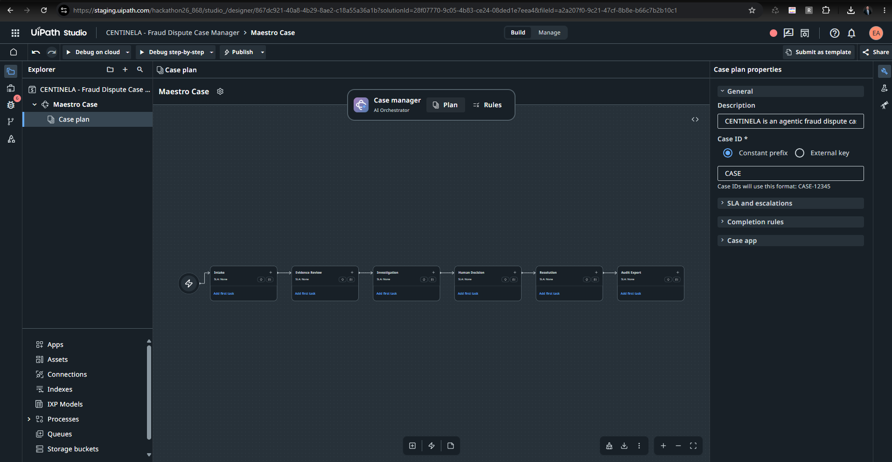
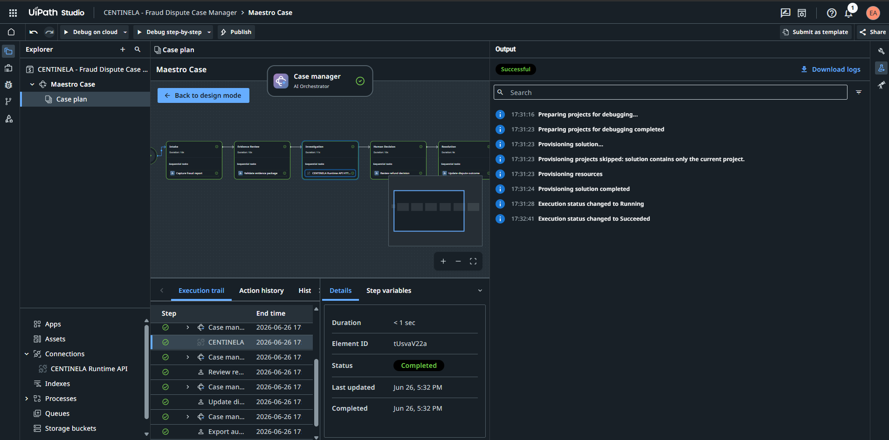
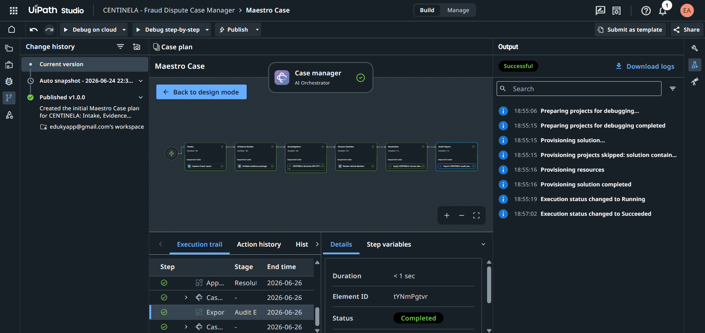
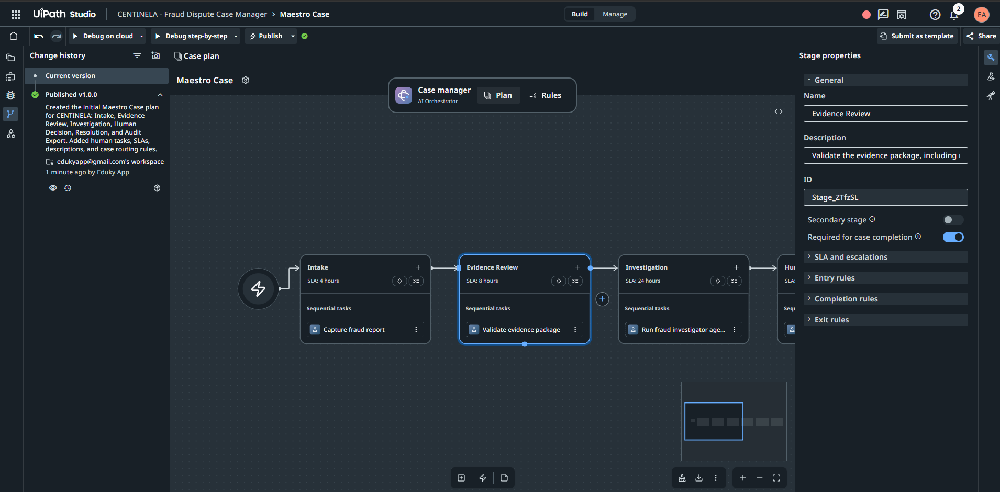
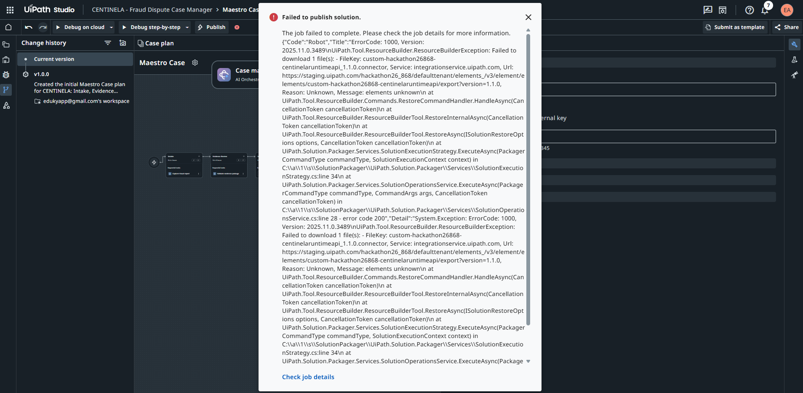
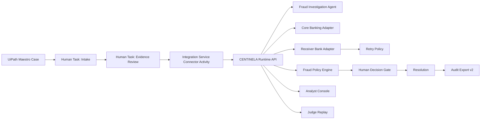
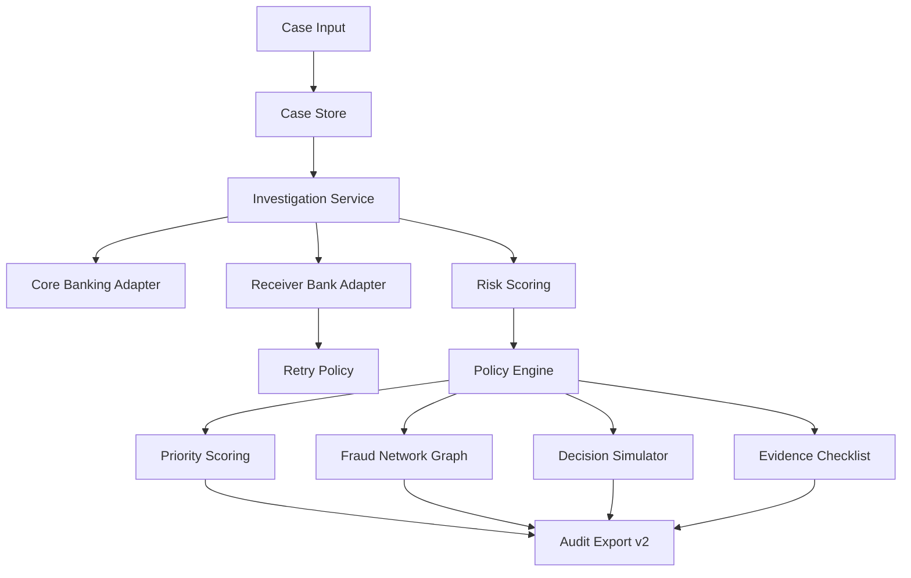

# CENTINELA — UiPath-Governed Fraud Dispute Intelligence

Agentic case management for instant-payment fraud disputes: UiPath Maestro orchestrates the case, CENTINELA Runtime investigates, humans decide, and every step is auditable.


CENTINELA is not an AI that approves refunds. It is a governed fraud case-management system where UiPath coordinates the lifecycle, the Runtime investigates, policy controls escalation, and humans remain accountable for financial decisions.

| Resource | Link |
| :--- | :--- |
| **Judge Replay** | [https://centinela-uipath-agenthack.onrender.com/judge](https://centinela-uipath-agenthack.onrender.com/judge) |
| **Analyst Console** | [https://centinela-uipath-agenthack.onrender.com/analyst](https://centinela-uipath-agenthack.onrender.com/analyst) |
| **Runtime Health** | [https://centinela-uipath-agenthack.onrender.com/health](https://centinela-uipath-agenthack.onrender.com/health) |
| **OpenAPI** | [https://centinela-uipath-agenthack.onrender.com/openapi.json](https://centinela-uipath-agenthack.onrender.com/openapi.json) |
| **GitHub Repo** | [https://github.com/jpablortiz96/centinela-uipath-agenthack](https://github.com/jpablortiz96/centinela-uipath-agenthack) |
| **UiPath Evidence Pack** | [docs/UIPATH_EVIDENCE_PACK.md](docs/UIPATH_EVIDENCE_PACK.md) |
| **Product Feedback** | [docs/UIPATH_PRODUCT_FEEDBACK.md](docs/UIPATH_PRODUCT_FEEDBACK.md) |
| **Runtime Architecture** | [docs/RUNTIME_ARCHITECTURE.md](docs/RUNTIME_ARCHITECTURE.md) |
| **Claims** | [docs/CLAIMS.md](docs/CLAIMS.md) |

---

## Judge Evaluation Path

1. **Start with Judge Replay**
   URL: [https://centinela-uipath-agenthack.onrender.com/judge](https://centinela-uipath-agenthack.onrender.com/judge)
   *Purpose:* Guided replay of API-down fraud case, retry exhaustion, human decision, and audit export.

2. **Open Analyst Console**
   URL: [https://centinela-uipath-agenthack.onrender.com/analyst](https://centinela-uipath-agenthack.onrender.com/analyst)
   *Purpose:* Inspect Priority Queue, Fraud Network, Decision Simulator, Evidence Checklist, and Audit Timeline.

3. **Review UiPath Evidence Pack**
   Path: `docs/UIPATH_EVIDENCE_PACK.md`
   *Purpose:* Verify Maestro Case, connected cloud debug, and Integration Service connector evidence.

4. **Review Product Feedback**
   Path: `docs/UIPATH_PRODUCT_FEEDBACK.md`
   *Purpose:* Understand the custom connector packaging limitation and body serialization workaround.

5. **Run public smoke tests**
   ```bash
   python scripts/smoke_test_centinela_runtime.py --base-url https://centinela-uipath-agenthack.onrender.com
   python scripts/smoke_test_analyst_console.py --base-url https://centinela-uipath-agenthack.onrender.com
   python scripts/smoke_test_judge_replay.py --base-url https://centinela-uipath-agenthack.onrender.com
   ```

---

## The Problem

Instant payments move faster than traditional fraud operations. When a customer disputes a transaction, the evidence is often incomplete, external bank APIs are sometimes unreachable, receiver information conflicts, and the customer demands rapid resolution.

Fully autonomous AI decisions are risky in financial disputes. Enterprises need governed orchestration, auditable investigation, retry handling, policy-based escalation, and strict human accountability. 

### Why traditional automation is not enough:
*   Static workflows fail when external systems (like receiver bank APIs) are unavailable or timeout.
*   Pure AI agents are hard to govern, prone to hallucination, and risky when financial impact is involved.
*   Manual case handling is slow, inconsistent, and expensive.
*   **CENTINELA combines the best of all worlds: UiPath orchestration, deterministic investigation, policy gates, and human review.**

---

## The Solution

CENTINELA solves this through a hybrid agentic architecture:
*   **UiPath Maestro** governs the dynamic case lifecycle and SLAs.
*   **CENTINELA Runtime** investigates fraud signals and external bank responses as a coded agent.
*   **Retry policy** handles receiver bank API failure deterministically.
*   **Policy engine** forces critical or unresolvable cases into human decision.
*   **Analyst Console and Judge Replay** make the system inspectable, reproducible, and operationally viable.

### What happens in the main scenario:
1. A fraud dispute is created.
2. Receiver bank API fails (API Down).
3. Runtime retries 3 times.
4. Retry exhaustion triggers a "critical" risk status.
5. Policy engine requires a human gate.
6. Human decision approves refund.
7. Resolution is applied.
8. Audit package is exported.
9. Analyst Console shows priority, network, evidence, and decision simulator.

---

## UiPath Is the Control Plane

UiPath Maestro is not decorative in this architecture—it is the authoritative control plane.

*   Maestro models and governs the case stages, SLAs, human tasks, and transitions.
*   Integration Service Connector Activity invokes the CENTINELA Runtime API from the case flow.
*   UiPath keeps humans accountable at key decision points, ensuring financial decisions are strictly governed.
*   CENTINELA Runtime acts as the deterministic external fraud investigation service/agent that Maestro orchestrates.
*   The connected flow is validated in cloud debug.
*   Connected publish is not claimed due to a UiPath Labs packaging limitation.

**Supported Claim:**
> "UiPath Maestro executed a connected end-to-end cloud debug flow where Investigation, Resolution, and Audit Export interacted with the public CENTINELA Runtime API through Integration Service connector activities."

| UiPath Component | How CENTINELA uses it | Why it matters | Evidence |
| :--- | :--- | :--- | :--- |
| Maestro Case | Defines case stages, SLAs, human tasks | Provides the core governance framework. | `evidence/manual-screenshots/step12_maestro_case_published.png` |
| Human Actions | Manual accountability gates | Ensures humans make financial decisions. | `evidence/manual-screenshots/step8_maestro_case_stages.png` |
| SLAs | Deadlines for resolution | Drives case prioritization. | `evidence/manual-screenshots/step10_maestro_case_slas.png` |
| Routing / Stages | Intake -> Evidence -> Investigation -> Decision -> Resolution -> Audit | Maps the real-world operational flow. | `evidence/manual-screenshots/step8_maestro_case_stages.png` |
| Integration Service Connector Activity | Invokes Runtime API for investigation and resolution | Connects UiPath to external agents safely. | `evidence/manual-screenshots/step20_maestro_connector_successful_debug.png` |
| Studio Web Debug on cloud | Validates connected execution | Proves the connector integration works. | `evidence/manual-screenshots/step28_maestro_end_to_end_connected_debug.png` |
| Orchestrator / Solutions | Deployment target | Proves platform readiness. | `evidence/manual-screenshots/step12_orchestrator_deployment_active.png` |
| Published Maestro Case v1.0.0 | The published definition of the case | Proves completion of the core Maestro design. | `evidence/manual-screenshots/step12_maestro_case_published.png` |

---

## UiPath Execution Evidence Gallery


*UiPath Maestro Case with dynamic fraud dispute stages: Intake, Evidence Review, Investigation, Human Decision, Resolution, and Audit Export.*


*Investigation stage connected to CENTINELA Runtime API through UiPath Integration Service Connector Activity.*


*Connected cloud debug execution completed successfully inside UiPath Maestro.*


*Published Maestro Case v1.0.0 available in UiPath environment.*


*Connected publish limitation captured as product feedback: custom connector packaging/export issue in UiPath Labs.*

## What the UiPath screenshots prove

| Screenshot | What it proves | Why it matters |
| :--- | :--- | :--- |
| Maestro Case stages | UiPath models the fraud case lifecycle | Track 1 alignment |
| Connector Activity | UiPath invokes Runtime API from the case flow | UiPath is orchestration layer |
| Debug Successful | Connected execution works in UiPath cloud debug | Real execution evidence |
| Publish limitation | Connected publish blocked by Labs packaging issue | Honest product feedback |

---

## Architecture Overview



### Runtime Architecture


---

## Case Lifecycle

| Stage | Actor | UiPath Role | Runtime Role | Output | Human Accountability |
| :--- | :--- | :--- | :--- | :--- | :--- |
| **Intake** | Human / Maestro | Orchestrates form & queue | N/A | Fraud report captured | High |
| **Evidence Review** | Human / Maestro | Orchestrates validation | N/A | Evidence validated | High |
| **Investigation** | Maestro + Runtime | Triggers connector activity | Executes API-down logic, retries, and risk scoring | Investigation complete, risk assessed | Low (Automated) |
| **Human Decision** | Human / Maestro | Orchestrates human approval task | Enforces policy gate requiring human | Decision (Refund/Reject) | **Critical** |
| **Resolution** | Maestro + Runtime | Triggers resolution endpoint | Applies the financial decision | Case marked resolved | Low (Automated execution of human intent) |
| **Audit Export** | Maestro + Runtime | Triggers export endpoint | Generates the immutable v2 audit package | Audit package retrieved | Low (Automated) |

---

## Runtime Capabilities

### 8.1 Deterministic Fraud Investigation Agent
CENTINELA Runtime operates as a coded deterministic agent/service, not an uncontrolled LLM. It executes specific investigative strategies based on the case state, ensuring reproducible and auditable results.

### 8.2 Banking Adapters
The Core Banking Adapter and Receiver Bank Adapter are synthetic, deterministic adapters built for safe hackathon evaluation. They are designed using enterprise patterns (e.g., dependency injection) so they can be seamlessly replaced with real banking APIs in a production environment.

### 8.3 Retry Policy
The Runtime gracefully handles external system failures. It emits specific retry events:
*   `ReceiverBankRetryScheduled`
*   `ReceiverBankRetryAttempted`
*   `ReceiverBankRetryExhausted`

### 8.4 Policy Engine
The policy engine evaluates the risk and state of the case to determine the next action:
*   Critical risk always requires a human decision.
*   Receiver bank API down (after retries exhausted) always requires a human decision.
*   Refund/funds-freeze outcomes always require a human decision.
*   Low-risk cases may auto-resolve based on policy thresholds.

### 8.5 SLA Status
The runtime deterministically calculates SLAs: `within_sla`, `at_risk`, and `breached`.

### 8.6 Audit Export v2
The runtime generates a comprehensive, immutable JSON export containing:
`case_summary`, `risk_summary`, `policy_summary`, `sla_summary`, `analyst_brief`, `customer_response_draft`, `timeline`, `limitations_notice`, `fraud_network`, `priority_summary`, `decision_simulator`, `evidence_checklist`, and `linked_case_signals`.

---

## Fraud Intelligence Layer

The Fraud Intelligence Layer provides enterprise-grade insights to support, but not replace, the human analyst.

| Feature | What it does | Why it matters to enterprise fraud operations |
| :--- | :--- | :--- |
| **Priority Queue** | Ranks cases using risk, SLA, retry exhaustion, and amount. | Focuses analysts on the most critical financial risks first. |
| **Fraud Network Graph** | Connects entities, IP addresses, and devices. | Reveals organized fraud rings instead of isolated incidents. |
| **Decision Simulator** | Projects the financial and compliance impact of a refund vs. reject decision. | Reduces human error by showing the consequences before action is taken. |
| **Evidence Checklist** | Validates the presence of required documentation. | Ensures compliance with internal banking regulations. |
| **Linked Case Signals** | Identifies related active disputes. | Accelerates investigation by surfacing overlapping fraud attempts. |
| **Analyst Brief** | A deterministic, human-readable summary of the case state. | Reduces cognitive load and investigation time. |
| **Customer Response Draft** | A pre-drafted communication based on the case decision. | Standardizes customer service and speeds up resolution. |

---

## Analyst Console — Operational Fraud Workspace

**[https://centinela-uipath-agenthack.onrender.com/analyst](https://centinela-uipath-agenthack.onrender.com/analyst)**

The Analyst Console provides a real-time operational view into the CENTINELA Runtime. Judges can see:
*   Executive KPI strip
*   Priority Queue
*   Investigation Intelligence
*   Fraud Network Graph
*   Decision Simulator
*   Human Review Pack
*   Evidence Checklist
*   Linked Case Signals
*   Timeline and Raw JSON


---

## Judge Replay — Guided Evaluation Flow

**[https://centinela-uipath-agenthack.onrender.com/judge](https://centinela-uipath-agenthack.onrender.com/judge)**

Judge Replay provides a safe, guided evaluation flow.
*   Offers one-click or guided step-by-step replay.
*   Shows the end-to-end lifecycle safely.
*   Exposes the business meaning of each API execution step.
*   Directly links to evidence and product feedback documentation.


---

## Public Runtime API

| Endpoint | Purpose | Used by |
| :--- | :--- | :--- |
| `GET /health` | System health check | Monitoring |
| `GET /openapi.json` | API Schema | Developers / Judges |
| `GET /analyst` | Serves the Analyst Console UI | Fraud Analysts |
| `GET /judge` | Serves the Judge Replay UI | Evaluators |
| `GET /uipath/maestro-api-down-default` | Starts an API-down case | UiPath Maestro (Integration Service) |
| `GET /uipath/maestro-approve-latest` | Applies human approval | UiPath Maestro (Integration Service) |
| `GET /uipath/maestro-export-latest` | Exports audit package | UiPath Maestro (Integration Service) |
| `GET /api/analyst/run-api-down-case` | Triggers a case for the console | Analyst Console UI |
| `GET /api/analyst/approve-latest` | Approves a case for the console | Analyst Console UI |
| `GET /api/analyst/export-latest` | Retrieves case data for the console | Analyst Console UI |
| `GET /api/judge/replay` | Executes the full guided replay sequence | Judge Replay UI |

Sample command:
```bash
curl https://centinela-uipath-agenthack.onrender.com/health
```

---

## Evidence & Reproducibility

| Evidence | Path | What it proves | Why it matters |
| :--- | :--- | :--- | :--- |
| End-to-end Debug | `evidence/manual-screenshots/step28_maestro_end_to_end_connected_debug.png` | Maestro connector executed successfully in cloud debug. | Validates the core integration architecture works on UiPath. |
| Analyst Console v2 | `evidence/manual-screenshots/step29_analyst_console_render.png` | Successful Analyst Console initial deployment. | Proves UI capabilities are live. |
| Analyst Console v3 | `evidence/manual-screenshots/step35_analyst_console_v3_render.png` | Polished, enterprise-grade console execution. | Demonstrates strong UX/UI focus. |
| Judge Replay | `evidence/manual-screenshots/step36_judge_replay_render.png` | Guided evaluation interface is live. | Lowers the barrier to evaluation for judges. |
| Latest Export JSON | `evidence/logs/step28_maestro_latest_export_after_debug.json` | The final payload pulled by UiPath via Maestro. | Proves the API returns the correct audit structure. |
| Post-Maestro Log | `evidence/logs/step28_post_maestro_render_smoke.txt` | API stability after UiPath execution. | Validates runtime stability. |
| Analyst Console Log | `evidence/logs/step29_analyst_console_render_smoke.txt` | Successful Analyst Console smoke validation. | Ensures the UI endpoints are stable. |
| Runtime Log | `evidence/logs/step37_runtime_render_smoke.txt` | Complete runtime lifecycle validation. | Proves the core logic executes flawlessly. |
| Analyst Console Run Log | `evidence/logs/step37_analyst_console_render_smoke.txt` | Latest Analyst console validation. | Verifies stability post-updates. |
| Judge Replay Log | `evidence/logs/step37_judge_replay_render_smoke.txt` | Judge replay validation. | Verifies the replay mechanism works. |
| UiPath Evidence Pack | `docs/UIPATH_EVIDENCE_PACK.md` | Aggregated evidence mapping. | Centralizes proof for easy review. |
| Product Feedback | `docs/UIPATH_PRODUCT_FEEDBACK.md` | Detailed bug report for UiPath Labs limitation. | Shows deep platform engagement. |
| Runtime Architecture | `docs/RUNTIME_ARCHITECTURE.md` | Technical documentation. | Explains the underlying systems. |
| Claims | `docs/CLAIMS.md` | Honest mapping of what works vs what is mocked. | Establishes trust and transparency. |

---

## Running Locally

1. Clone the repository:
   ```bash
   git clone https://github.com/jpablortiz96/centinela-uipath-agenthack.git
   cd centinela-uipath-agenthack
   ```
2. Create and activate a virtual environment:
   ```bash
   python -m venv .venv
   # On Windows:
   .venv\Scripts\activate
   # On Mac/Linux:
   source .venv/bin/activate
   ```
3. Install dependencies:
   ```bash
   pip install -r requirements.txt
   ```
4. Run the runtime:
   ```bash
   python -m uvicorn apps.centinela_runtime.main:app --reload --port 8070
   ```
5. Open the operational interfaces:
   - [http://127.0.0.1:8070/judge](http://127.0.0.1:8070/judge)
   - [http://127.0.0.1:8070/analyst](http://127.0.0.1:8070/analyst)
   - [http://127.0.0.1:8070/openapi.json](http://127.0.0.1:8070/openapi.json)

---

## Smoke Tests

Local execution:
```bash
python scripts/smoke_test_centinela_runtime.py --base-url http://127.0.0.1:8070
python scripts/smoke_test_analyst_console.py --base-url http://127.0.0.1:8070
python scripts/smoke_test_judge_replay.py --base-url http://127.0.0.1:8070
```

Public Render execution:
```bash
python scripts/smoke_test_centinela_runtime.py --base-url https://centinela-uipath-agenthack.onrender.com
python scripts/smoke_test_analyst_console.py --base-url https://centinela-uipath-agenthack.onrender.com
python scripts/smoke_test_judge_replay.py --base-url https://centinela-uipath-agenthack.onrender.com
```
Passing tests prove that the public API, the intelligence layers, the retry mechanics, and the UIs are fully functional and deterministic.

---

## Deployment

CENTINELA Runtime is deployed continuously on Render.
*   **Method:** Render Web Service via direct GitHub integration.
*   **Start Command:** `uvicorn apps.centinela_runtime.main:app --host 0.0.0.0 --port $PORT`

---

## Known Limitation

> **No Overclaims:** CENTINELA does not claim production banking readiness, real customer fraud detection, autonomous refund approval, or connected solution publish. It does claim a public Runtime API, working Analyst Console, Judge Replay, published Maestro Case v1.0.0, and connected UiPath cloud debug execution.

**Connected publish limitation:** The connected Maestro + custom connector flow runs successfully in cloud debug. Publishing the connected version is currently blocked by a UiPath Labs custom connector packaging/export limitation. The published Maestro Case v1.0.0, connected debug evidence, public Runtime API, Analyst Console, and Judge Replay remain available for evaluation.

This limitation is meticulously documented in `docs/UIPATH_PRODUCT_FEEDBACK.md` with reproduction context, impact, and suggested improvements. We utilized no-body `GET` endpoints to ensure robust execution within the Labs debug environment, bypassing current Integration Service body serialization issues.

---

## Product Feedback

CENTINELA generated highly actionable product feedback for UiPath during the hackathon:
*   API Workflow publish limitations.
*   Custom connector packaging/export failures ("elements unknown").
*   Connector activity body serialization issues in Labs.
*   Required no-body endpoint workarounds.
*   Suggested diagnostics and improvements for the platform.

This feedback aims to help harden Maestro Case and Integration Service for enterprise use.

---

## Why This Is Agentic

CENTINELA is deeply agentic because:
*   It receives a dynamic case context.
*   It gathers signals automatically from simulated adapters.
*   It handles external failure and schedules retries autonomously.
*   It evaluates risk and policy dynamically.
*   It determines the next required action based on the state.
*   **It escalates to human review instead of blindly deciding.**
*   It produces explainable decision support (Simulator, Network, Checklist).
*   **UiPath coordinates the lifecycle, actors, and accountability.**

**Agentic does not mean autonomous without control. In CENTINELA, agentic means adaptive investigation under UiPath governance.**

---

## Why We Avoided Autonomous Refund Approval

*   Financial decisions require strict human accountability.
*   The Runtime recommends, explains, and prepares evidence.
*   UiPath keeps the human securely in the loop.
*   This approach is far safer, compliance-friendly, and enterprise-ready than autonomous LLM execution.

---

## Built with Coding-Agent Workflow

CENTINELA was built with a coding-agent-assisted engineering workflow (using Antigravity/Claude) and is structured to demonstrate how coding agents can aggressively accelerate enterprise automation development, while UiPath securely governs the final execution. Coding agents were utilized to scaffold the architecture, develop the UIs, harden the APIs, and construct the rigorous test suites.

---

## Repository Structure

| Directory | Purpose |
| :--- | :--- |
| `apps/centinela_runtime/` | The core FastAPI backend, UIs, and intelligence logic. |
| `apps/chaos_console/` | (Legacy/Local) Local orchestration testbed. |
| `docs/` | Evidence packs, architecture docs, and product feedback. |
| `evidence/` | Screenshots, JSON exports, and smoke test logs. |
| `scripts/` | Python smoke test suites for automated validation. |

---

## Security and Production Readiness

Current (Hackathon State):
*   Synthetic data and deterministic adapters.
*   JSONL / memory-based lightweight persistence.
*   Public unauthenticated endpoints for frictionless judge evaluation.

Production Path (Future State):
*   Authentication and RBAC integration.
*   Secret management for real API keys.
*   Real banking API integrations.
*   Database persistence (PostgreSQL/SQL Server).
*   PII controls and masking.
*   Rate limiting and monitoring.
*   UiPath production tenant deployment using standard, non-Labs connector packaging.

---

**CENTINELA is not an AI that approves refunds.**
**CENTINELA is a UiPath-governed fraud case management system that investigates, prioritizes, explains, escalates, and audits — while keeping humans accountable for high-impact financial decisions.**
