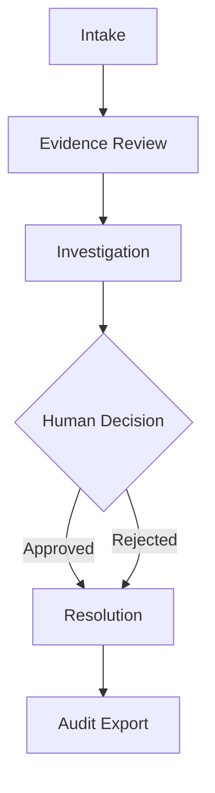

# Architecture: Case Lifecycle

The lifecycle of a fraud dispute in CENTINELA follows a robust, multi-step process orchestrated by UiPath Maestro Case.

## 1. Intake
The customer submits a fraud claim via a simulated channel (e.g., chat, web portal). The **Intake Agent** captures the core details (Amount, Sender, Receiver, Date) and the provided evidence.

## 2. Evidence Review
The **Evidence Agent** utilizes Document Understanding to parse uploaded receipts or chat screenshots. It grades the `evidence_quality` and checks for tampering or inconsistencies.

## 3. Investigation
The **Fraud Investigator Agent** takes over. It is a coded Python agent intended to be orchestrated by UiPath Maestro Case. It calls mock banking APIs (Receiver Bank API, Core Banking API) and calculates deterministic risk. This is where the chaos happens:
- APIs might time out.
- Evidence might conflict.
- Maestro Case manages state, handles retries, and catches exceptions to prevent the case from dying.

## 4. Human Decision
If the investigation encounters high risk, ambiguous evidence, or requires a final sign-off, the case escalates to a human agent via **UiPath Action Center**.

## 5. Resolution
Based on the investigation and human input, the system executes the final action (e.g., issuing a refund, declining the dispute).

## 6. Audit Export
A comprehensive, immutable log of all agent actions, API calls, retries, and human decisions is exported for compliance and auditing purposes.
